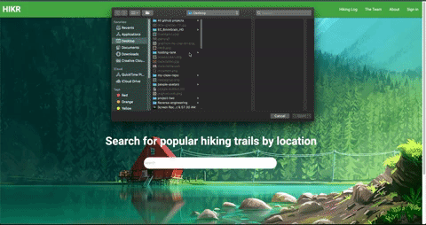

# HIKR
People will go through many journals through their lifetimes. Journals will constantly be lost, stolen, or damaged admist life itself.The amount of information being lost within those endeavors, and not to mention the amount of physical resources that go into developing a journal, are costly. **That's why HIKR was created.** To protect the journals of hikers across nation's and aid in the conservationalism of wildlife. HIKR's still in development and will continuously be till our team fulfills the goals we had since day one. 

## Deployed Site
[Live Site](https://hikr-journal.herokuapp.com/)

## Site gif



## Guest URL
If you would like to protoype this app, please use the login: guest@email.com and password: password

## Summary
HIKR is a personalized journal that allows the user to search for hike trails and generate a customized journal from a given location. Highly favors privacy and the aid for the conservationism. Hikr also allows the user to find the nearest trails based on a location search query. The search query will return any given trails that the user can add a personalized journal to. This is made with the sole purpose for users to recall a trails details, experiences, and moments the user would like to add to journals.

## Technologies Used
* Express-Handlebars
* Express
* Passport.js
* MySQL
* Sequelize
* Bcrypt
* Express-session
* Mapbox API
* Hiking project API

## Authors
* [Sierra Chapman (Back-end Developer)](https://github.com/SierraChapman)
* [Hannah Smith (Back-end Developer)](https://github.com/hannahpsmith1 )
* [Daniel Jauregui (Front-end Developer)](https://github.com/Kionling)


## Message from the developers
This repository requires a set of NPM packages. These NPM packages are essential for the complete functionality of this application. 
Below are instructions to install the said NPM packages.
**For a clean install (No package.json)**
```

- Locate HIKR directory. 
- In the HIKR directory 
- In terminal run the following:
npm init -y
THEN
npm install package_names

```

**With package.json**
```
npm install 
```

## AJAX Call to MapBox and Hiking Project to produce Hiking Details and embedded map
```javascript

router.get("/trails", (req, res) => {
  // route: "/trails?q=LOCATION_SEARCH_TERM"

  // keep track of place name so we can verify that the correct location was found
  let placeName;
  // make API call to MapBox to get coordinates
  axios.get(`https://api.mapbox.com/geocoding/v5/mapbox.places/${req.query.q}.json?access_token=${MAPBOX_API_KEY}`)
  .then(response => {
    const coords = response.data.features[0].center;
    placeName = response.data.features[0].place_name;
    // console.log(maps)
    console.log(`${placeName}: ${coords}`);
    // make API call to The Hiking Project to get trails near coordinates
    return axios.get(`https://www.hikingproject.com/data/get-trails?lon=${coords[0]}&lat=${coords[1]}&key=${TRAILS_API_KEY}`);
  })
  .then(response => {
    console.log(`${response.data.trails.length} trails found!`);
    // this will be changed to res.render()
    trailList = response.data.trails.map(trail =>{
      // trail.latitude
      trail.mapUrl = `https://api.mapbox.com/styles/v1/mapbox/streets-v11.html?title=false&zoomwheel=false&access_token=pk.eyJ1IjoiaGFubmFocHNtaXRoMSIsImEiOiJja2Q5NXdocDkzODd6MzZxcjgwcGo0N292In0.hXZmM8t-GwS-zvBVyiTxJQ#13/${trail.latitude}/${trail.longitude}`
      return trail
    })
    // map = "https://api.mapbox.com/styles/v1/mapbox/streets-v11.html?title=false&zoomwheel=false&access_token=pk.eyJ1IjoiaGFubmFocHNtaXRoMSIsImEiOiJja2Q5NXdocDkzODd6MzZxcjgwcGo0N292In0.hXZmM8t-GwS-zvBVyiTxJQ#13/34.751/-104.436";
    // console.log(response.data)
    res.render("search", {placeName: placeName, trails: trailList});
  })
  .catch(err => {
    console.log(err);
    res.send("An error occurred...")
  });
});
```

We were able to call 2 different API's.  Sierra was the mastermind of our original AJAX Calls. First, we called  Mapbox, which converted the user's search input field of a city/state/county,  to latitude's and longitudes. Then we were able to inpu the search input data to the Hiking Journal API and render seraches.  The conversion of a search input into a lat long is called forward geocoding. Hannah adapted the API Lat, Long to be able to construct a map function for any searched place with  an embeded Map for all searched trails.


## Final statements
We are happy you have chosen to user HIKR. We have put countless hours to reach the state in which we have always wanted HIKR to be since day one. We will do our very best to continously update HIKR and add features as time goes on. I'd like to thank Hannah Smith and Sierra Chapman for being amazing teammates throughout the development. I could not have asked for better teammates throughout this process. I hope my teammates will grow beyond this project and always think of the HIKR days. Thank you again for choosing HIKR!